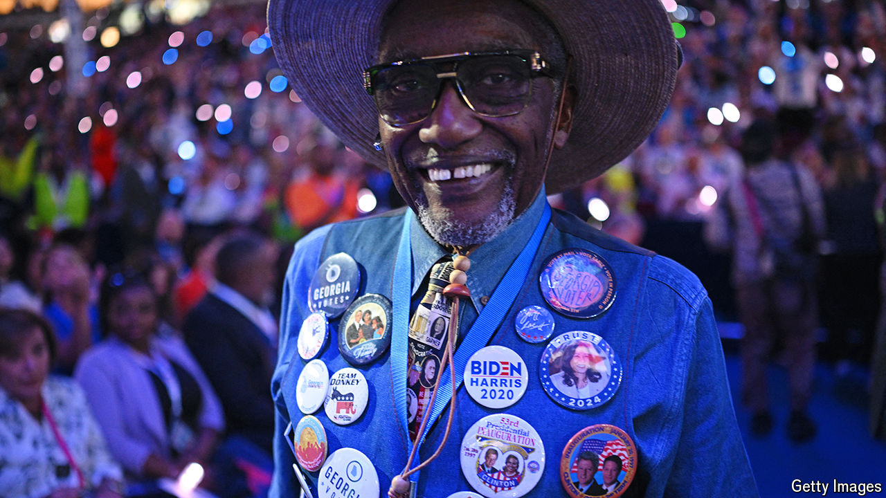

###### The world this week

# Politics 

#####  

 

> Aug 22nd 2024 

The Democrats held their  in Chicago. Ahead of Kamala Harris’s speech accepting the party’s nomination,  made what may be his last big appearance as president. During Hillary Clinton’s address the Democrats chanted “lock him up!” in reference to Donald Trump, delighting the party’s candidate in the 2016 election. Far-left and pro-Palestinian activists clashed with police outside the Israeli consulate, but were kept well away from the convention hall. 

