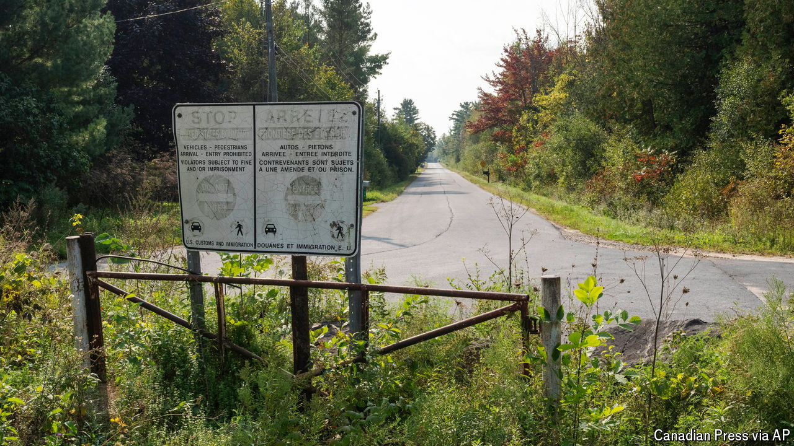

###### The new frontier

# Behind the surge in migrants crossing America’s northern border 

##### The shift exemplifies the fluid nature of migration 

 

> Aug 21st 2024 

“WE MOVED TO a dead-end road,” says Daniel Labarge. A beer is lodged in the cup holder of his tractor as he goes about his Friday-afternoon chores. “Nice, calm, quiet. Then all of a sudden it blew up.” Mr Labarge’s farm in Champlain, New York, is within spitting distance of America’s northern border. A few years ago his unassuming street, Roxham Road, became a destination for migrants crossing north into . Now, he says, the foot traffic is coming from the other direction.

