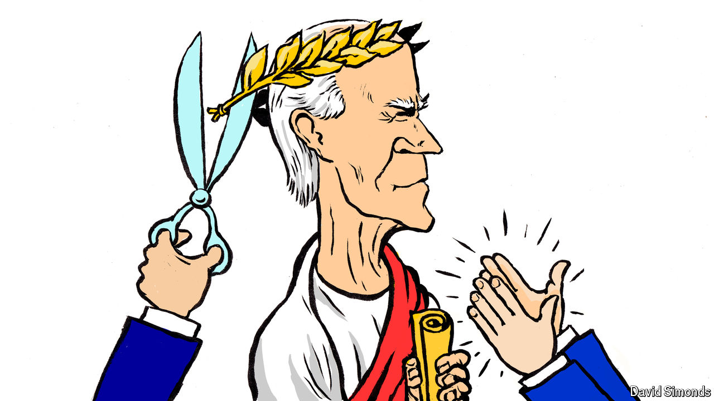

###### Lexington

# History will judge Joe Biden by Kamala Harris 

##### A victory would be her triumph, and his, but a loss would be his responsibility 

 

> Aug 20th 2024 

THE DEMOCRATS came to their convention in Chicago to praise Joe Biden, and to bury him. No one wanted to dwell on the recent unpleasantness, on how a handful of party eminences pried the nomination from his clenched hands like so many adult children compelling their fading father to surrender the car keys. Suddenly, it was hard to find anyone who thought nominating Mr Biden again, at the age of 81, was ever a good idea, no matter how many Democratic officials used to insist it was. By the time the convention began on August 19th the last of Joe Biden’s many campaigns had come to seem sad, even scary, certainly embarrassing: time to leave it behind.

