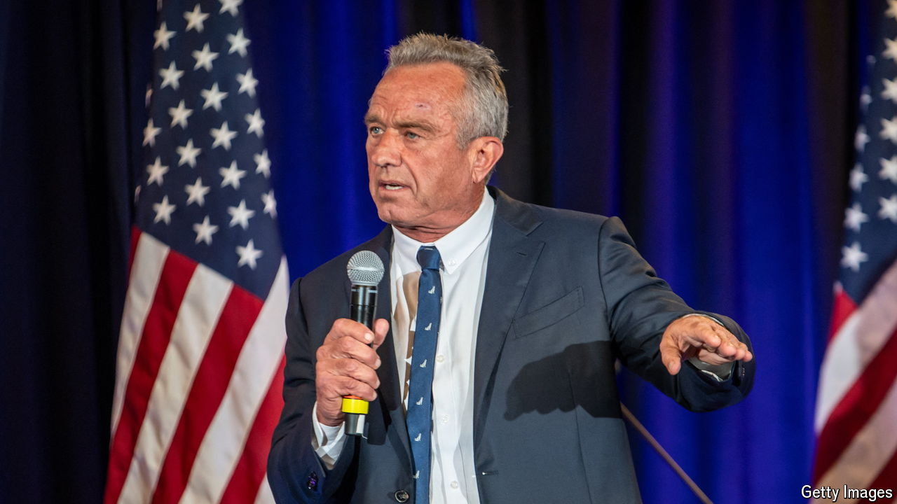

###### Spoiler alert

# Kamala Harris is winning back third-party voters 

##### Historically, polls have tended to overstate the strength of third parties 

 

> Aug 19th 2024 

Kamala Harris and Donald Trump are sure to be on the ballot in  in all 50 states. Not so all the would-be candidates from third parties. Several such candidates have been facing the distraction of lawsuits that seek to stop them competing in some states.

