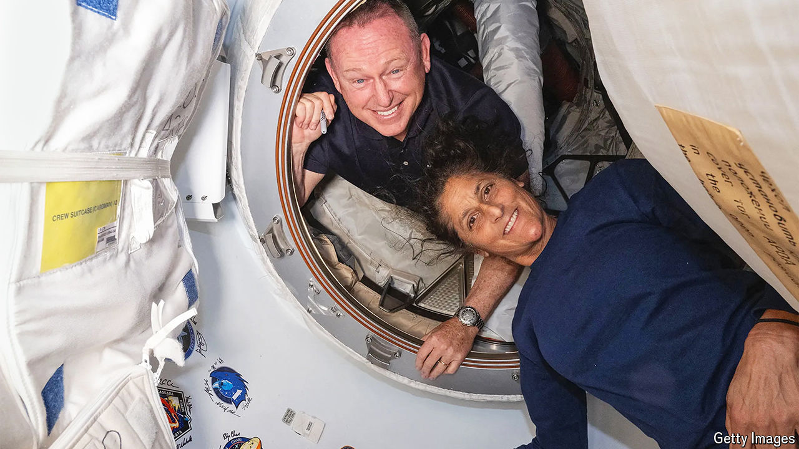

###### Stuck in low-Earth orbit

# NASA insists that two astronauts are not “stranded” in space 

##### The Starliner mishap is another embarrassment for Boeing 

 

> Aug 22nd 2024 

What a treat to glimpse the cosmos up close. Which is not to deny the inconveniences of space travel. There are bodily troubles. “The toilet—I literally sit on it like a witch on a broom,” wrote Valentin Lebedev, a cosmonaut, in his diary. “It won’t forgive your mistakes.” Suffice to say that relieving oneself in zero gravity involves leg restraints, gloves, disinfectant and a device like a vacuum cleaner. 

