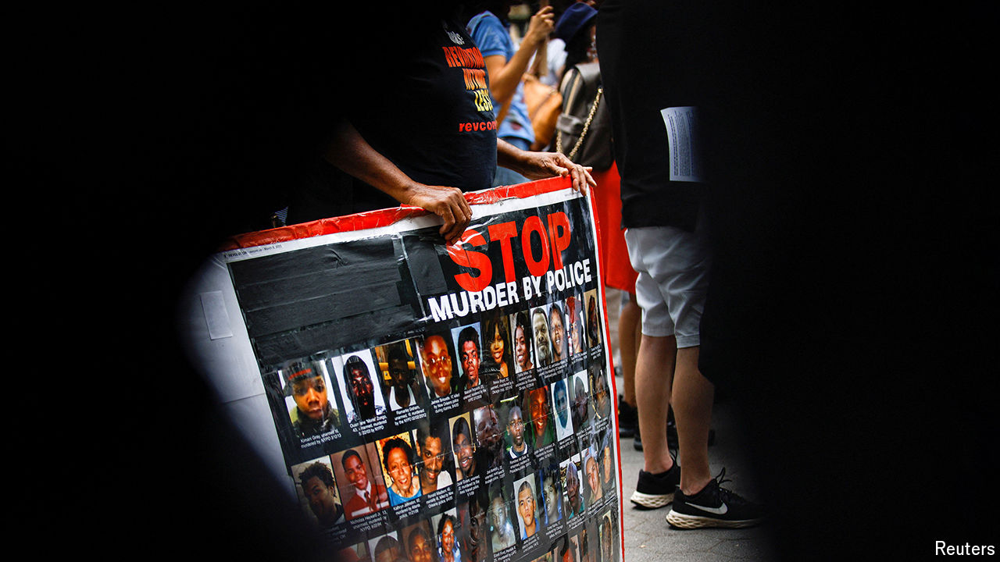

###### More deaths, less outrage

# Police are killing more Americans than ever. Where’s the outrage? 

##### The scarcity of protests is striking 

 

> Aug 22nd 2024 

THE DAY before Sonya Massey, a 36-year-old black woman in Springfield, Illinois, was killed by a police officer, her mother phoned 911. “The mental people told me to call 911,” she told the dispatcher, reporting that her daughter was having a breakdown. “She thinks everybody’s after her,” she explained, adding: “Please don’t send no combative policemen that are prejudiced, please...They’re scary.” The next day, Ms Massey called 911 herself to report that she was scared of intruders. Her mother’s fears were proved to be entirely founded. Within minutes of their arrival, one of the two responding officers, Sean Grayson, was threatening to “shoot her in the fucking face” unless she dropped a pot of boiling water she was moving off the stove. Then he did exactly that.

