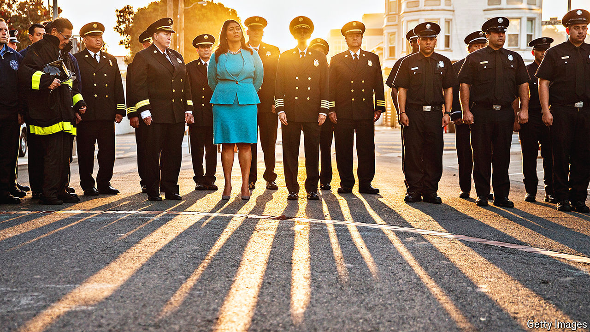

###### The view from the Bay

# San Francisco Democrats are embracing “law and order” politics 

##### Who is going to tell Donald Trump? 

 

> Aug 17th 2024 

“ARE YOU in a good spot for hearing?” one woman asks another as they shuffle into a sitting room at a retirement home in . They fold their walkers and await Mark Farrell, a Democratic candidate for mayor in the city’s November elections. Mr Farrell launches into a typical stump speech—he grew up in San Francisco, is bringing up children there—but the conversation quickly turns darker. What will he do about crime,  and drugs, the audience wants to know? Mr Farrell has an answer characteristic of San Francisco’s changing politics. “We’re gonna bring them off the streets,” he says. “Hopefully it’s shelter, maybe it’s hospital, maybe it’s county jail.”

