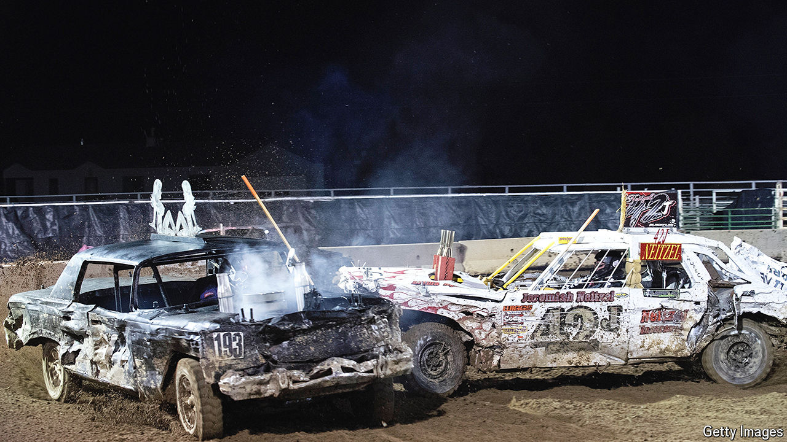

###### A smashing time

# Where crashing cars is the point 

##### Making sense of demolition derbies 

 

> Aug 22nd 2024 

After the formalities are seen to—the national anthem sung, the firemen assembled—the fun starts. The sound brings the first thrill: a dozen engines thundering, each without a silencer, and the crackle-pop of backfire. Then comes the crash and crumple of metal on metal. Tyres go flat, bumpers fall off. Cars catch fire, others get pushed up against the wall. They head-butt like billy goats. They hiss, wheeze, smoke, stall and go kaput. Soon only two are still moving, at which point the announcer might growl: “Finish him!”

