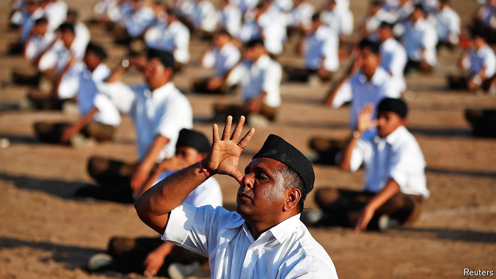

###### Fraying saffron

# Narendra Modi faces a new threat: his Hindu-nationalist patrons 

##### India’s prime minister needs to fix a rift with the group that launched his career 

 

> Aug 28th 2024 

Narendra Modi, India’s prime minister, likes to do yoga to relieve stress. He might have had to do some extra  following India’s general election result in June. With his Bharatiya Janata Party (BJP) now  in parliament, he has had to cut deals with coalition partners to remain in power. To appease young voters , he has hurriedly recalibrated his budget to boost spending on job creation. And he recently suffered a big foreign-policy setback with the ouster of Sheikh Hasina, a close ally, as prime minister of Bangladesh.

