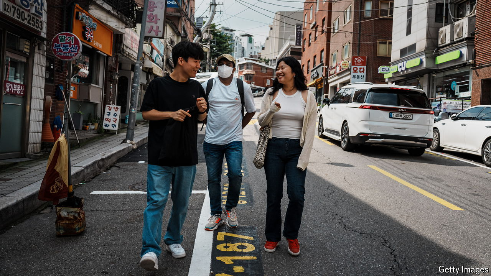

###### Visa lottery

# Rich parts of Asia are on the hunt for immigrants 

##### But the demographic maths remain unforgiving 

 

> Aug 29th 2024 

For a lesson on how complaining gets results, look to South Korea. Economists have long warned the country’s shrinking working-age population would create a shortfall, but few have moaned about it as assiduously as the business lobby. Finally, their pressure has yielded results. Last year the quota for E-9 visas, which cover “non-professional” workers, was 120,000, by a wide margin the most ever (see chart). This year the E-9 quota will rise to 165,000. The total stock of migrant labour increased by 9% in 2023.

