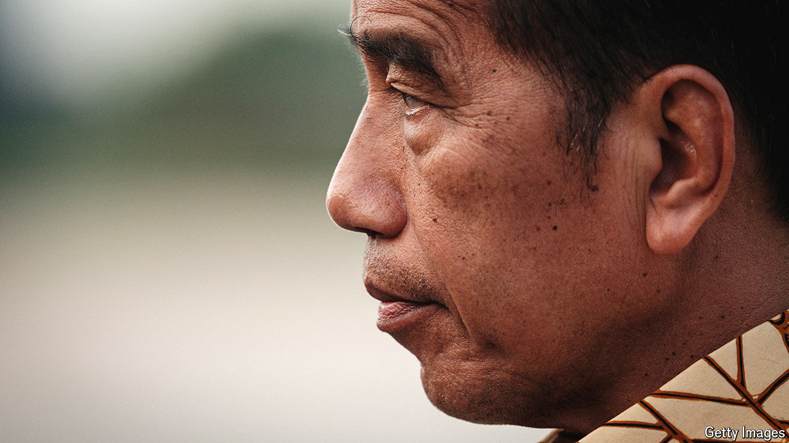

###### Succession in Indonesia

# The King of Java inflames an Indonesian “democratic emergency” 

##### Jokowi is clinging to power and protesters are angry about it 

 

> Aug 29th 2024 

It was the kind of move that Suharto, a strongman who ruled Indonesia with an iron fist from 1967 to 1998, would have admired. Joko Widodo, Indonesia’s president, staged a hostile takeover of the late dictator’s party, Golkar, on August 21st, when its members elected Bahlil Lahadalia, the president’s fixer and Indonesia’s energy minister, as its chair. No one dared run against Mr Bahlil. In a smug victory speech, the new chair warned his charges “not to play around with the King of Java”—a clear reference to Jokowi, as the president is known—adding that it would end badly for them.

