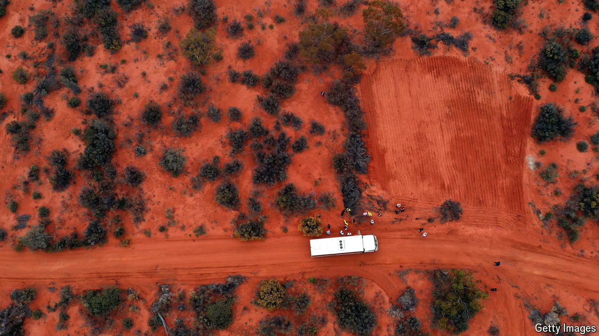

###### Not digging it

# Why Australia is not yet a critical minerals powerhouse 

##### A string of lithium and nickel mines have closed this year 

 

> Aug 29th 2024 

On the face of it, Australia should have a huge advance in the race for critical minerals. Its red centre holds large reserves of the minerals and rare earths that are vital for green and military technologies. Its centre-left Labor government wants to dig and process more of them. It should be the perfect match. 

