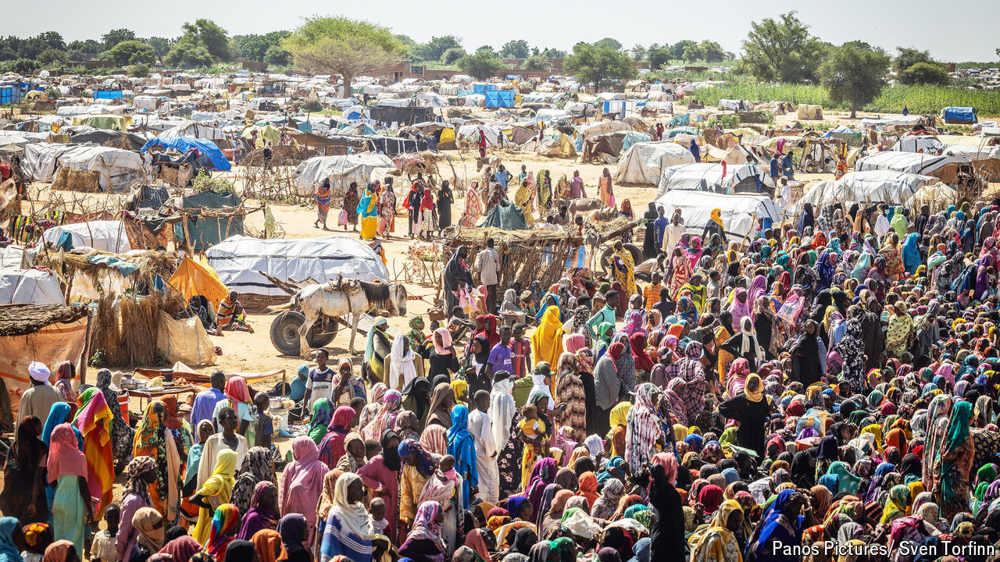

###### An intensifying calamity

# Anarchy in Sudan has spawned the world’s worst famine in 40 years 

##### Millions are likely to perish 

 

> Aug 29th 2024 

IT IS OFFICIAL: for only the third time in the past 20 years, the UN has declared a full-blown famine. The declaration concerns a refugee camp called Zamzam, on the outskirts of the city of el-Fasher in Sudan. As long ago as April, Médecins Sans Frontières, a charity, estimated that every two hours a child in the camp was dying from starvation or disease—and since then the situation has got worse.

