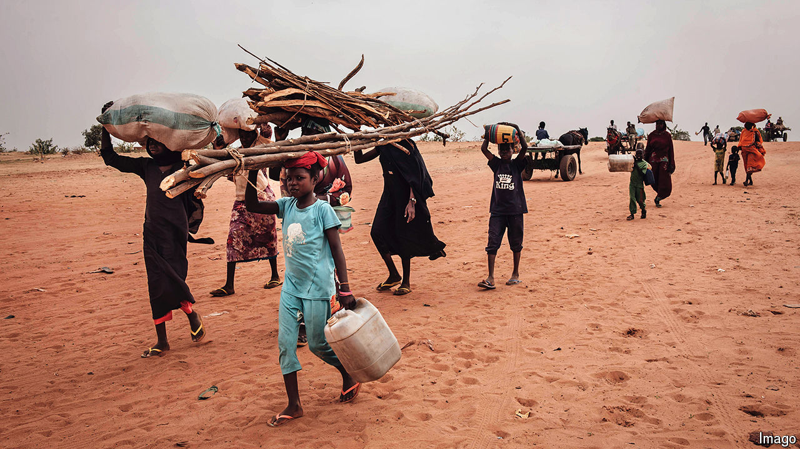

###### Chaos machine

# The ripple effects of Sudan’s war are being felt across three continents 

##### It is a sign of growing global impunity and disorder 

 

> Aug 29th 2024 

IT IS HARD to see past the human tragedy of the war in Sudan. Perhaps 150,000 people have died since fighting began last year and more than 10m have fled their homes. Millions could perish in the world’s worst famine for at least 40 years. These are reasons enough to care about the conflict. But the collapse of Sudan, at the intersection of Africa and the Middle East, with seven fragile neighbours and some 800km of coast on the turbulent Red Sea, has alarming geopolitical consequences, too. 

