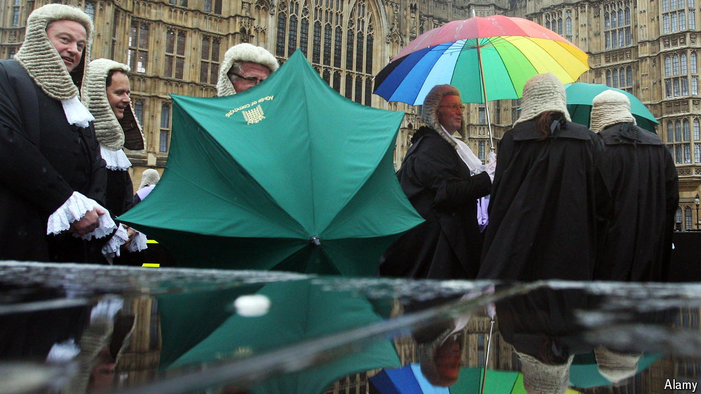

###### Keep up, your honour

# A language guide for judges is a window into modern Britain 

##### And into the mind of the judiciary 

 

> Aug 26th 2024 

A WELSHMAN, A Sikh and a transgender woman walk up to the bar. It sounds like a joke, but in this instance the “bar” separating the judge from a courtroom has served as a synonym for the legal world since the 14th century. In July the Judicial College, which is responsible for the training of judges in England and Wales, issued its latest triennial update of the “Equal Treatment Bench Book” (ETBB). Its advice on how judges should address different litigants and witnesses is more than just a training guide. The ETBB offers a portrait of modern Britain.

