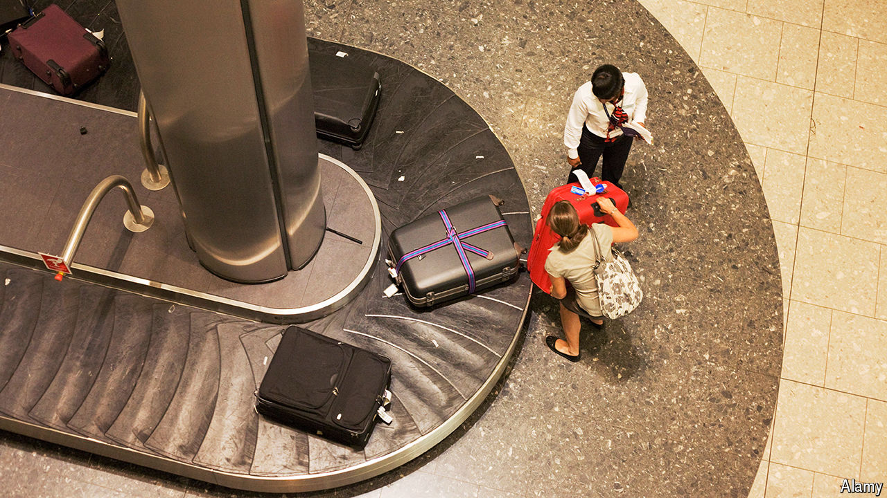

###### Do not go to gate

# Heathrow’s third runway asks questions of the airport and Labour 

##### A decades-long saga is not over yet 

 

> Aug 29th 2024 

Heathrow Airport has a new boss and two new investors. Yet some familiar problems continue to affect it. After two summers punctuated by flight cancellations, passengers are bracing for more disruption. Around 650 border-force workers at Heathrow are due to go on strike from August 31st until September 3rd in protest at newly introduced work rotas.

