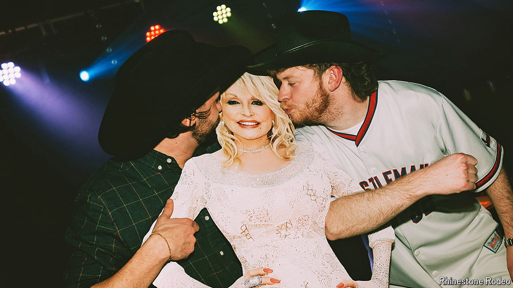

###### What ho, y’all

# Why country music is booming in Britain 

##### TikTok, tattoos and dreams of Texas 

 

> Aug 29th 2024 

“All aboard the freight train,” Rattlesnake Johnny announces from the DJ booth, as he plays Alan Jackson’s “Freight Train”. A large crowd, sporting cowboy hats and boots, obediently falls into a Conga line and belts out “wish I was a freight train, baby”. They are led by “Memo the Hero”, a Turkish man from Newcastle, who waves an American flag as dancers gyrate on tables. 

