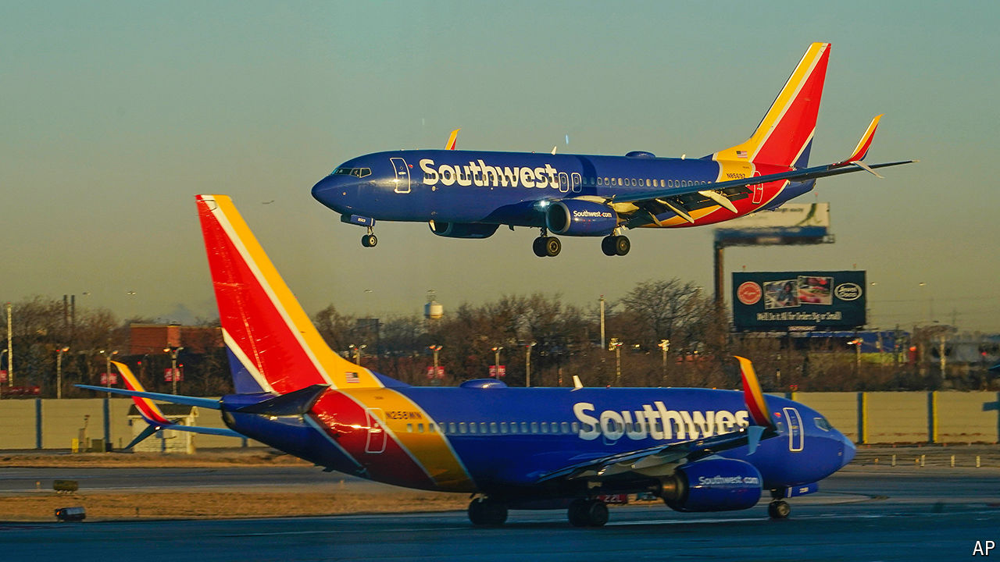

###### Hard landing

# From Southwest to Spirit, budget airlines are in a tailspin 

##### The woes of America’s low-cost carriers could soon be mirrored elsewhere 

 

> Aug 29th 2024 

When Southwest Airlines launched in 1971, flying three Boeing 737 jets between Dallas, Houston and San Antonio, few imagined the impact its business model would have on the aviation industry in America and beyond. In the decades that followed, low-cost carriers (LCCs) pummelled incumbents by offering cheap, no-frills fares to keep costs down and planes full, flying point-to-point rather than connecting through big hubs. 

