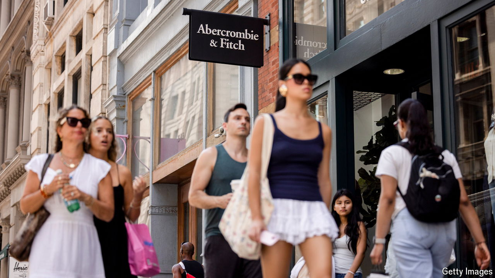

###### Back in style

# How Abercrombie & Fitch got hot again 

##### The once-troubled brand is now a favourite of millennials and gen-Zs alike 

 

> Aug 29th 2024 

For many, 2023 was the year of the chip. Just ask anyone holding shares in Nvidia, whose stock rose by 246%. But it was also the year of the Sloane Pant. The popular tailored trouser helped send the shares of Abercrombie &amp; Fitch, a 132-year-old clothing firm, up by 274% (see chart). 

