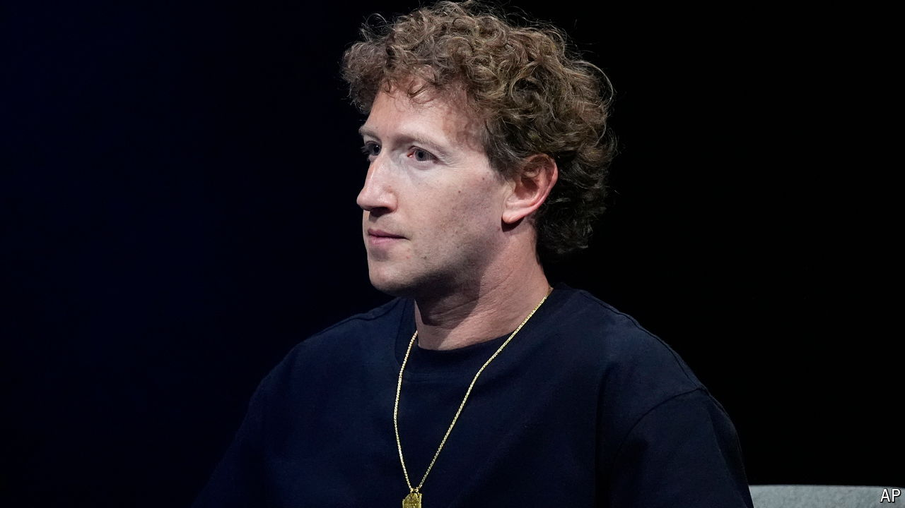

###### The Zuckerberg mankini

# Meta is accused of “bullying” the open-source community 

##### It hopes its models will set the standard for open-source artificial intelligence 

 

> Aug 28th 2024 

IMAGINE A beach where for decades people have enjoyed sunbathing in the buff. Suddenly one of the world’s biggest corporations takes it over and invites anyone in, declaring that thongs and mankinis are the new nudity. The naturists object, but sun-worshippers flock in anyway. That, by and large, is the situation in the world’s open-source community, where bare-it-all purists are confronting Meta, the social-media giant controlled by a mankini-clad Mark Zuckerberg.

