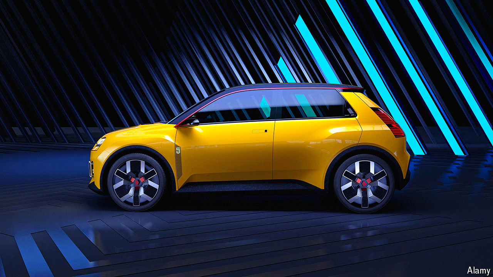

###### French correction

# Renault readies itself to take on Chinese rivals 

##### Luca de Meo is turning the carmaker around 

 

> Aug 29th 2024 

Parked outside the front doors of a handsome 1920s brick building in a Parisian suburb is a bright yellow Renault 5, a new electric vehicle (ev) unveiled by the French carmaker in February. It is permitted this enviable spot because it belongs to Luca de Meo, the boss of the company, whose top brass occupy the building. Mr de Meo has brought a renewed confidence to Renault since taking over as its chief executive four years ago. He has turned the business around—and readied it to take on the Chinese carmakers that are looking to expand in the European market. 

