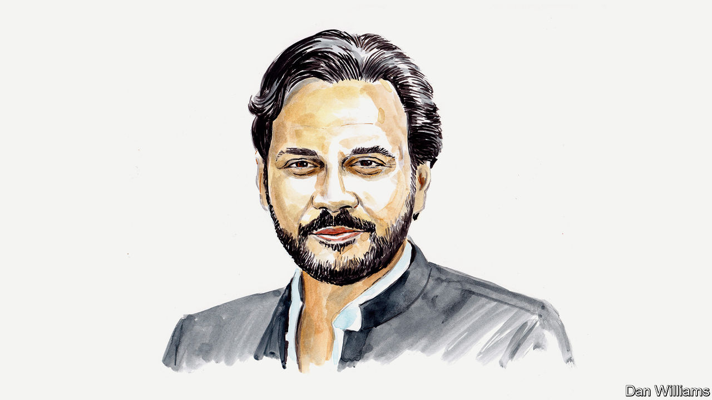

###### Debt and development

# Break the taboos propping up unsustainable debt, pleads a former central banker 

##### Murtaza Syed on overcoming fear of restructuring, cajoling creditors and encouraging the IMF to be candid 

 

> Aug 28th 2024 

A YEAR AGO, in an article for , I  that Pakistan’s policymakers and the IMF were flirting with disaster by pretending that the country’s public debt was sustainable. It was among 70 countries facing debt distress. A year on, only Ethiopia has defaulted and Sri Lanka is restructuring its debt, while Pakistan is on the cusp of a record 24th IMF programme. But this veneer of stability is no cause for celebration.

