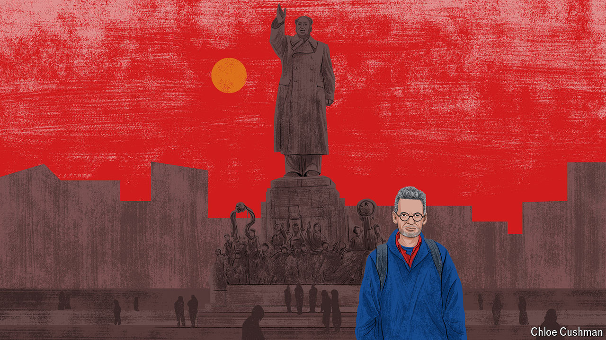

###### Our Beijing bureau chief’s valedictory dispatch

# China’s new age of swagger and paranoia 

##### It wants to be a “strong tiger” not a “fat cat” 

 

> Aug 28th 2024 

SHOULD THE world admire or fear China’s model of governance? Since this column was launched in September 2018 that question has become more urgent, as Xi Jinping declares it time for China to “move closer to the centre stage” of world affairs.

