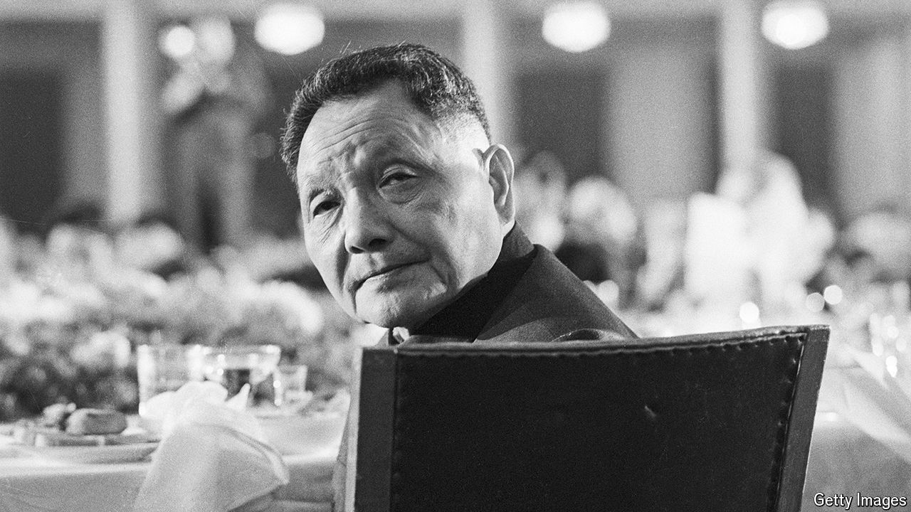

###### Two very different leaders

# Deng Xiaoping envy 

##### Xi Jinping tries to claim the mantle of his predecessor 

 

> Aug 29th 2024 

DENG XIAOPING was barely five feet tall, but China’s late ruler was a political giant. He was a leading figure in the Communist revolution and a hard-nosed Leninist. Yet, as ruler, he launched market-oriented reforms and opened China up to the world. On August 22nd, the 120th anniversary of Deng’s birth, China’s current leader, Xi Jinping, lauded his “extraordinary life”. 

