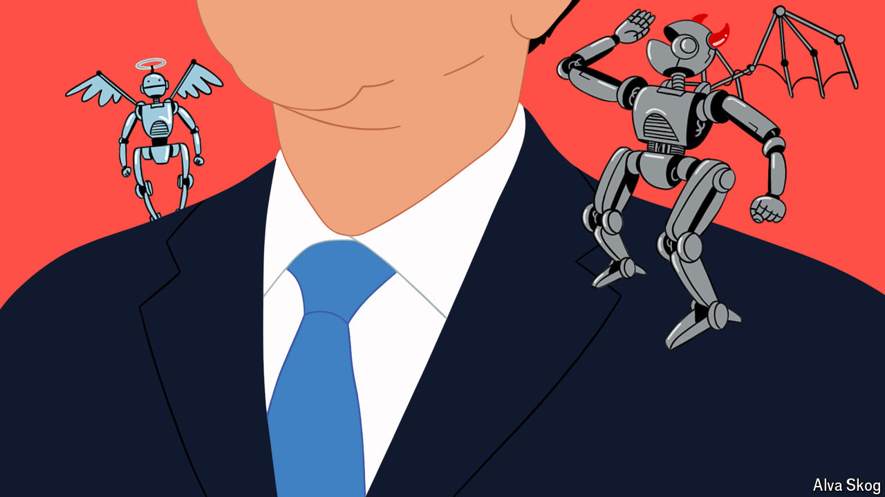

###### Technology and power

# Is Xi Jinping an AI doomer? 

##### China’s elite is split over artificial intelligence 

 

> Aug 25th 2024 

IN JULY last year  travelled to Beijing for the final time before his death. Among the messages he delivered to China’s ruler, Xi Jinping, was a warning about the catastrophic risks of . Since then American tech bosses and ex-government officials have quietly met their Chinese counterparts in a series of informal gatherings dubbed the Kissinger Dialogues. The conversations have focused in part on how to protect the world from the dangers of AI. American and Chinese officials are thought to have also discussed the subject (along with many others) when America’s national security adviser, Jake Sullivan, visited Beijing from August 27th to 29th.

