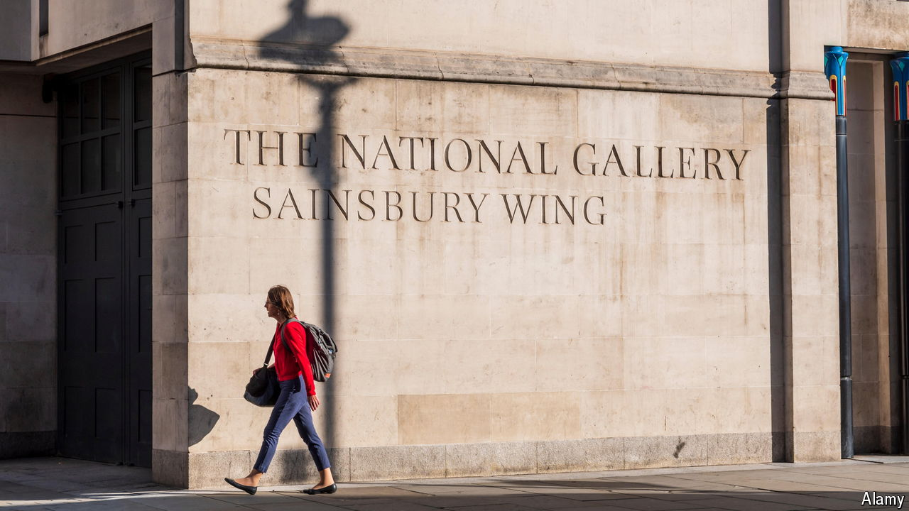

###### Master clash

# John Sainsbury, a donor to the National Gallery, had the last laugh 

##### A hidden letter offers an insight into disputes between artists and patrons 

 

> Aug 28th 2024 

THE TIME-CAPSULE letter from 1990 was written in passionate all-caps. Unearthed during a renovation of the Sainsbury Wing of the  in London, it denounced the ornamental column within which it was hidden as “A MISTAKE”. The author was “ABSOLUTELY DELIGHTED” that, since his letter had been discovered, the column and its twin must have been demolished.

