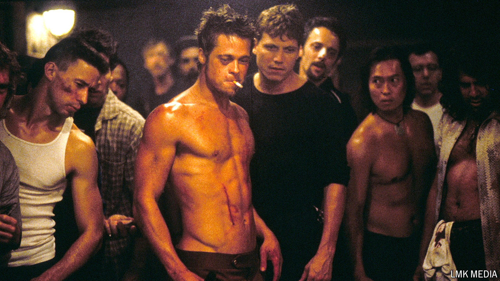

###### Back Story

# Twenty-five years on, “Fight Club” punches harder than ever 

##### Actually, the first rule of the cult film is that people never stop talking about it 

 

> Aug 23rd 2024 

IN THE scheme of history, the late 1990s were—for many in the West—a kind of nirvana. The ; liberal democracy was rampant. The phantom millennium bug was as big a worry as any. In this becalmed era Chuck Palahniuk published “Fight Club”, his scabrous novel of male alienation, which the director David Fincher adapted for the screen. Starring Brad Pitt as Tyler Durden, the red-leather-jacketed id of modern man, the film had its premiere 25 years ago, in September 1999.

