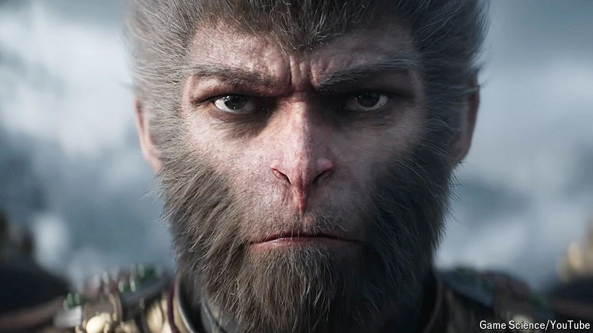

###### Monkey business

# “Black Myth: Wukong” is China’s first blockbuster video game 

##### Will there be more? 

 

> Aug 29th 2024 

YOU ARE thrust into the heat of battle—a clash so violent it has “disturbed heaven and Earth” and “alarmed both demons and gods”. Playing as Sun Wukong, aka the Monkey King, you wield the (a fabled staff weighing eight tonnes) and face down Erlang, a three-eyed warrior-god. You must be wily, not to mention nimble: Erlang’s axe can cleave entire mountains in two. (And you thought your day job was stressful.)

