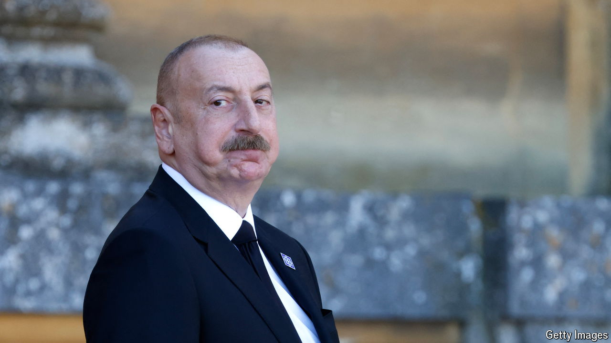

###### The new enemy

# Azerbaijan’s government turns on its critics at home 

##### The war with Armenia has ended in victory, so the regime needs another target 

 

> Aug 29th 2024 

Bahruz Samadov, a young Azerbaijani academic and writer, was arrested on August 21st. He has since been charged with treason, reportedly because he had written critical pieces about the country’s conflict with Armenia. His arrest was quickly followed by that of another peace activist, Samad Shikhi. These are the latest markers in a harsh and growing crackdown on the few remaining independent voices in the country. 

