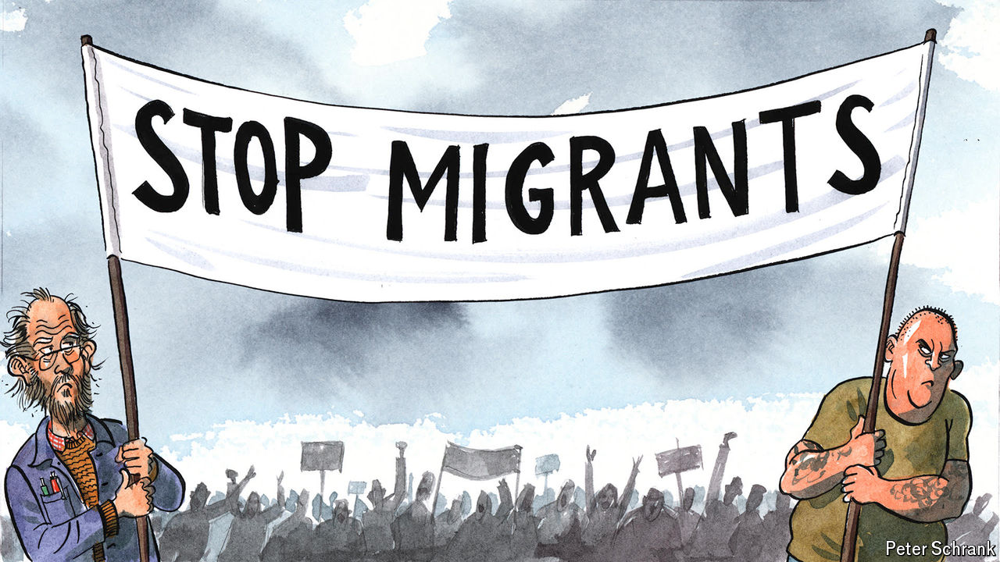

###### Charlemagne

# Europe’s lefties bash migrants (nearly) as well as the hard right 

##### Xenophobia is crossing the political spectrum 

 

> Aug 29th 2024 

As Europe faced a sharp rise in the arrival of migrants seeking asylum in 2015, many national governments demanded more be done to stem the flow. Sweden’s prime minister disagreed. “My Europe does not build walls,” Stefan Lofven, leader of the Social Democrats, thundered in response, exuding the high-mindedness left-wingers muster at will. A couple of electoral setbacks later—it turns out voters are rather keen on walls during migration crises—the party is speaking from a different register, this time as an opposition force. “The Swedish people can feel safe in the knowledge that Social Democrats will stand up for a strict migration policy,” Magdalena Andersson, its current leader, said in an interview to a local paper in December. Remember peace, open borders and the socialist brotherhood of man? Not Mrs Andersson. “Free immigration is not left-wing,” she now argues. 

