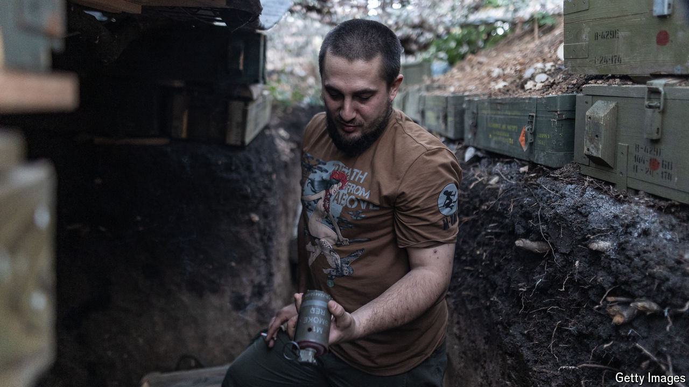

###### Fluid front lines

# Even as it humiliates Russia, Ukraine’s line is crumbling in the Donbas 

##### The shock raid inside Kursk has not distracted the Kremlin from advancing 

 

> Aug 29th 2024 

Four weeks into Ukraine’s advance into the Russian province of Kursk, the soundscape of war is changing. The rat-a-tat clap of enemy machineguns was always a feature, but now it is punctured by the clangs and agonies of direct hits. “The enemy has wised up,” complains Serhiy, an armoured-vehicle driver with the 80th brigade, one of the four key units that led the charge. “The firing was wild in the first few days. Now we are up against professional gunners, we think from the naval infantry.” Ukraine is continuing to edge forward, using electronic warfare and the green cover of summer to evade the worst of Russia’s attention. Their commanders in particular appear determined to push westward towards the natural frontiers of the Seym river. But the pace is slowing—and a new front line, stretching for hundreds of kilometres, is taking shape. 

