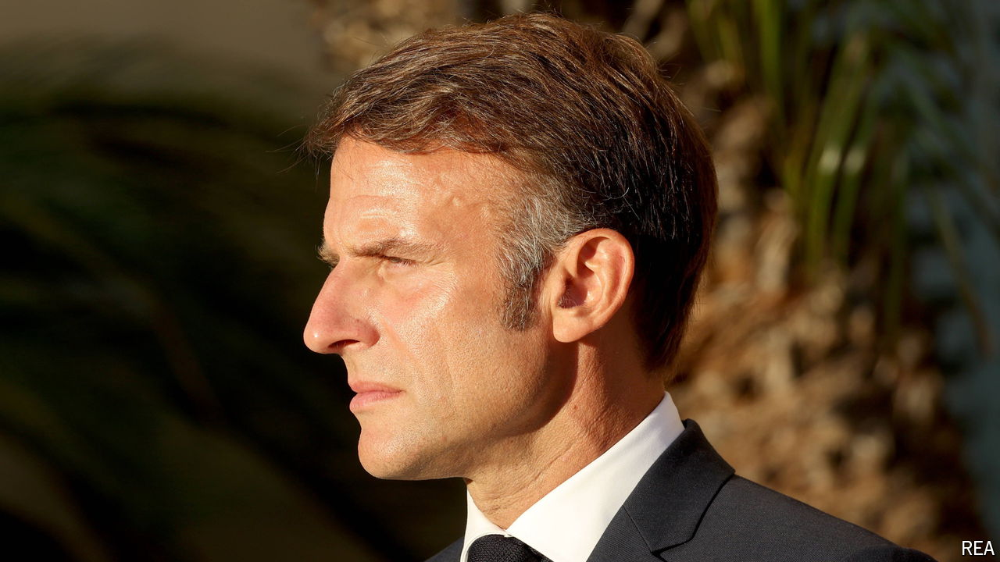

###### French politics

# France seeks a new government 

##### Emmanuel Macron’s long-running recruitment drive 

 

> Aug 29th 2024 

Almost eight weeks after an inconclusive legislative vote, France is still struggling to put together a new government. In other European countries, used to stitching together painstaking coalition deals between rivalrous political parties, this would be unremarkable. In 2017-18 it took Germany nearly six months, and even longer in the Netherlands earlier this year. But for France, which cherishes the stability that its Fifth Republic has brought since it was established in 1958, this hiatus is unprecedented. It reflects a failure to treat compromise as anything other than capitulation, and will render the new prime minister’s task unusually challenging. 

