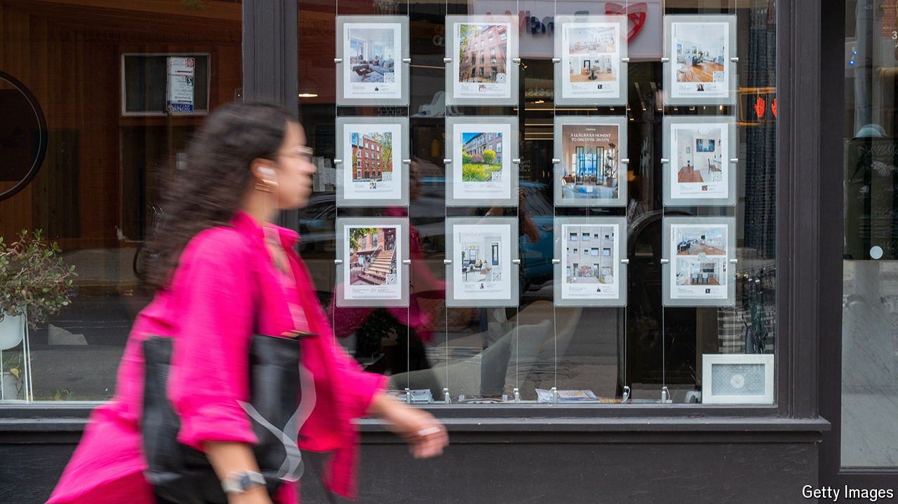

###### Trustbusting

# Are American rents rigged by algorithms? 

##### That is what Department of Justice prosecutors allege 

 

> Aug 29th 2024 

Imagine that you are about to enter a room with a group of nine other people. You will display a number—any between, say, 2,500 and 3,000. Once the group enters the room other players will start to come in. Each will choose one of your group, picking the lowest number. You do not know how quickly or slowly the other players will trickle in to pick from the group. What is the highest number you can display while still getting picked quickly?

