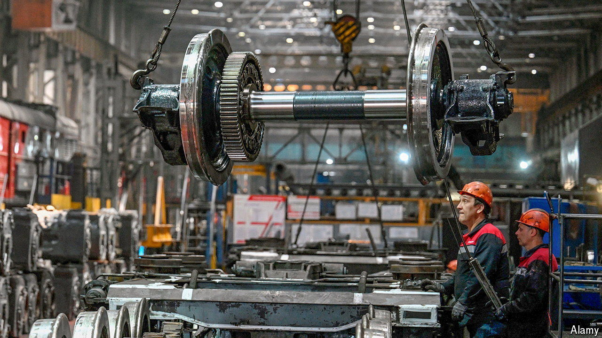

###### Eastern promise

# How Vladimir Putin hopes to transform Russian trade 

##### He believes the country’s future lies with China and India. What could go wrong? 

 

> Aug 28th 2024 

Vladimir Putin is spending big on his war in Ukraine. The Russian president has disbursed over $200bn, or 10% of GDP, on the invasion, according to America’s Department of Defence. He now plans to invest heavily in infrastructure that will enable his country’s economy to flourish even while cut off from the West. Over the next decade, the Russian state expects to funnel $70bn into the construction of transport routes to connect the country to trade partners in Asia and the Middle East. Russia’s far east and high north will receive the lion’s share; a smaller sum will go on the International North-South Transport Corridor (INSTC), a project designed to link Russia and the Indian Ocean via Iran. Officials promise growth in traffic along all non-Western trade routes.

