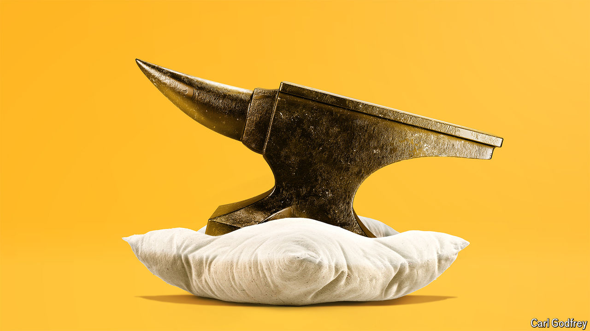

###### The cushioned blow

# Inflation is down and a recession is unlikely. What went right? 

##### A few years ago, nobody thought that a soft landing was possible 

 

> Aug 29th 2024 

Not long ago central bankers everywhere were jacking up interest rates. No longer. In June the European Central Bank reduced rates for the first time since before the covid-19 pandemic. In July policymakers at the Bank of England voted to cut rates. Other central banks, ranging from those in Canada and Chile to Denmark, are also in on the action. Before long America will follow. On August 23rd Jerome Powell, chair of the Federal Reserve, noted that “the time has come for policy to adjust”. And as central bankers loosen policy, they are daring to dream, for a “soft landing” is within reach.

