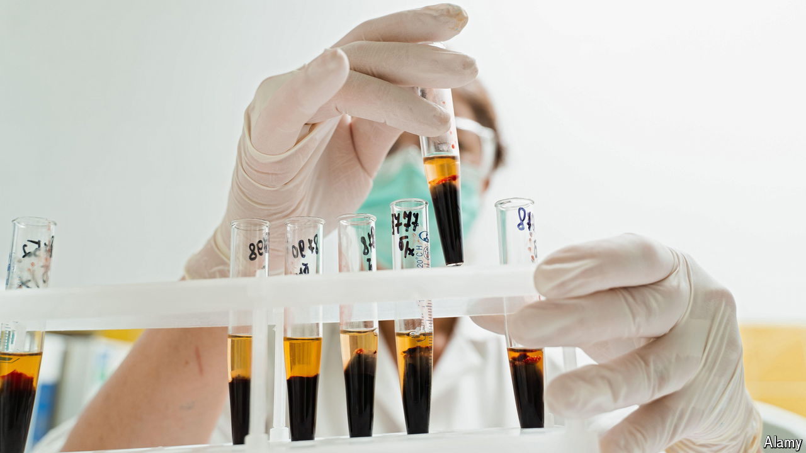

###### Blood boom

# The plasma trade is becoming ever-more hypocritical 

##### Reliance on America grows, as other countries clutch their pearls 

 

> Aug 29th 2024 

An unusual sort of business will soon open in Shelby, North Carolina. It will take over premises previously run by a flooring company, tucked in beside shops selling clothes, paint and fast food. But it will not sell anything itself. Instead, willing donors, paid around $40 a pop, will sit connected to an apheresis machine. Over the course of an hour, the machine will extract their blood, siphon out plasma and recirculate the remaining fluid. The plasma will then be made into medicines, such as clotting factors for haemophiliacs and intravenous immunoglobulins for those suffering from autoimmune diseases. 

