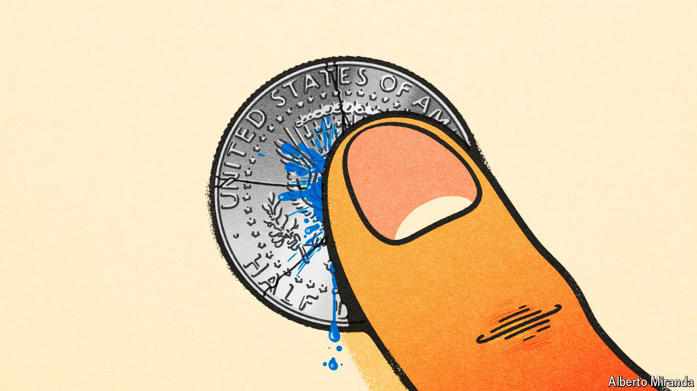

###### Free exchange

# Vast government debts are riskier than they appear 

##### A provocative new paper gets central bankers talking at Jackson Hole 

 

> Aug 27th 2024 

At the annual gathering of central bankers in Jackson Hole, Wyoming, attendees enjoy R&amp;R: research and recreation. The latter usually involves a pleasant hike by the lake, but last year a rainstorm soaked the assembled economists. When they returned on August 23rd a remarkably accurate weather forecast helped them dodge a shower and enjoy some sun. This was apt. A year ago inflation was still too high and investors were placing bets that interest rates would have to stay “higher for longer”, the economic equivalent of a drenching. This year inflation looks all but subdued and central bankers—whose optimistic prognostications have also come to pass—have started cutting interest rates.

