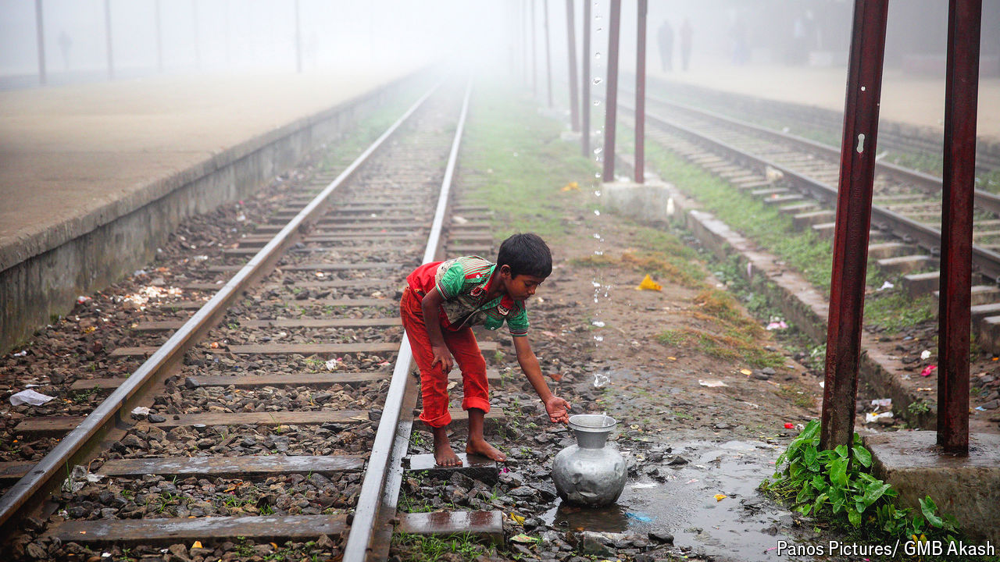

###### Too much, too little. Too late?

# The poisonous global politics of water 

##### Polarisation makes it harder to adapt to climate change 

 

> Aug 26th 2024 

THE WATER thieves come at night. They arrive in trucks, suck water out of irrigation canals and drive off. This infuriates Alejandro Meneses, who owns a big vegetable farm in Coquimbo, a parched province of Chile. In theory his landholding comes with the right to pour 40 litres of river-water a second on his fields. But thanks to drought, exacerbated by theft, he can get just a tenth of that, which he must negotiate with his neighbours. If the price of food goes up because farmers like him cannot grow enough, “there will be a big social problem,” he says.

