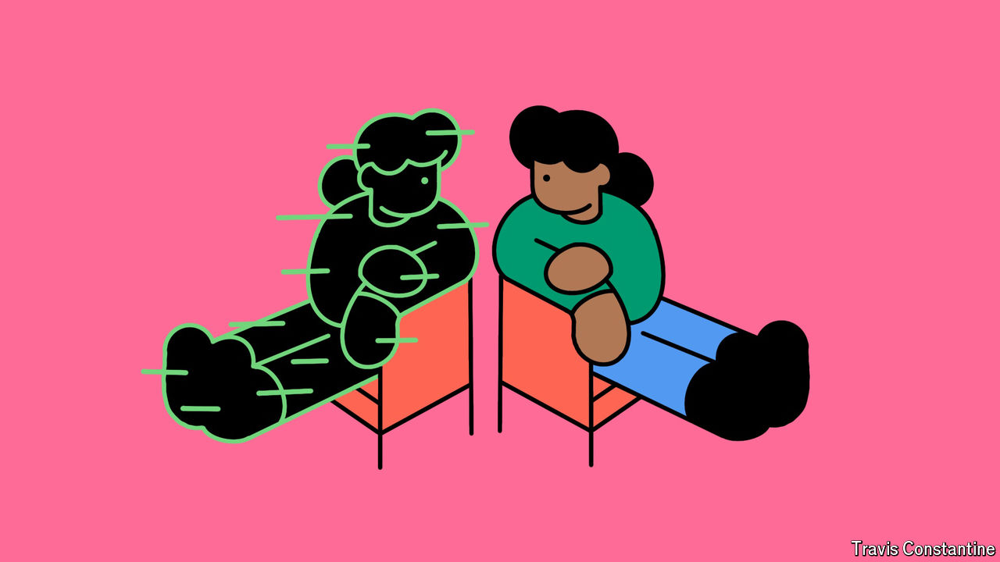

###### The virtual world

# Digital twins are fast becoming part of everyday life 

##### Welcome to the mirror world 

 

> Aug 29th 2024 

When visiting a doctor a few years from now, you can expect to be accompanied by a virtual version of yourself. This so-called digital twin will be a working model of your body that can be summoned onto a physician’s computer screen. Updated with your latest vital signs, it will help the doctor make an accurate diagnosis. It also opens the door for medicines and procedures designed specifically for you, greatly increasing recovery rates. 

