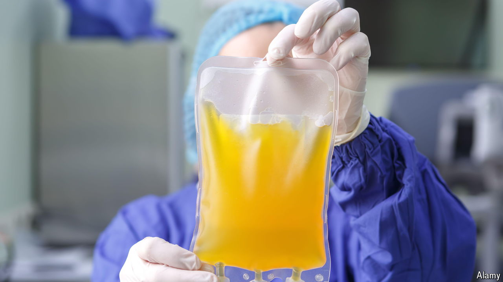

###### There must be blood

# People should be paid for blood plasma 

##### Shortages are hampering the production of essential medicines 

 

> Aug 29th 2024 

The trade in human blood might seem gruesome. In fact, it is essential. Plasma, the main component of blood, is a crucial ingredient for a range of medicines, from haemophilia treatments to rabies vaccines and tetanus jabs. And these days there is not enough of it to go around. 

