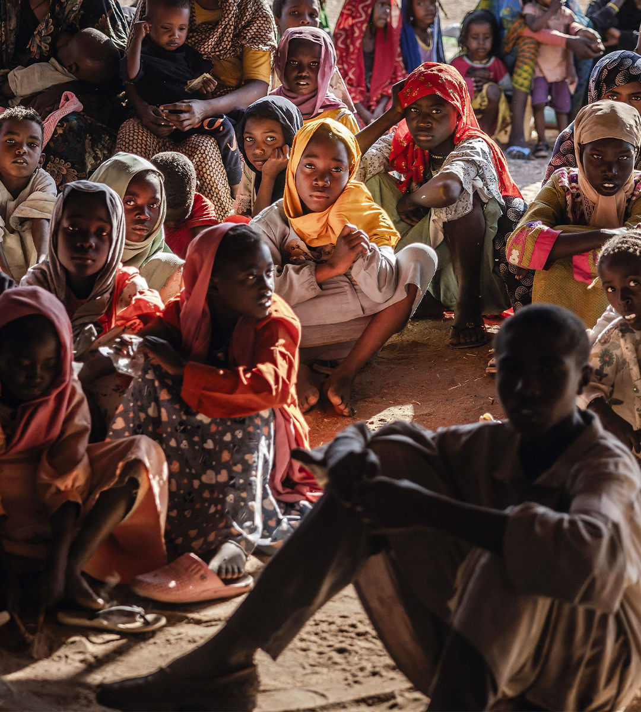

###### A humanitarian disaster

# Why Sudan’s catastrophic war is the world’s problem 

##### It could kill millions—and spread chaos across Africa and the Middle East 

 

> Aug 29th 2024 

The war in Sudan has received a fraction of the attention given to Gaza and Ukraine. Yet it threatens to be deadlier than either conflict. Africa’s third-largest country is ablaze. Its capital city has been razed, perhaps 150,000 people have been slaughtered and bodies are piling up in makeshift cemeteries visible from space. More than 10m people, a fifth of the population, have been forced to flee from their homes. A famine looms that could be deadlier than Ethiopia’s in the 1980s: some estimate that 2.5m civilians could die by the end of the year. 

