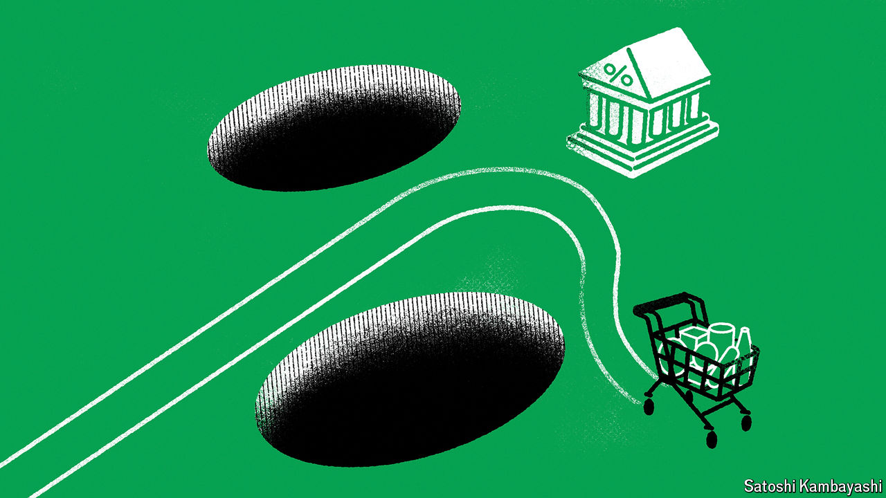

###### Good policy, not good luck

# Why inflation fell without a recession 

##### High interest rates, not the passage of time, have restored price stability 

 

> Aug 28th 2024 

AT THEIR annual retreat in Jackson Hole, central bankers celebrated the fall of inflation. But do they deserve the credit? In the rich world, annual price rises in the median country are down from a peak of about 10% in early 2022 to below 3% today. Remarkably, this has been achieved without deep recessions (see Finance &amp; economics section). The Federal Reserve will probably soon join central banks in Europe in cutting interest rates, bond yields have fallen sharply since the summer and stockmarkets have shrugged off a growth scare that struck at the beginning of August. America’s economy was in fact bigger in the second quarter of 2024 than had been forecast before the covid-19 pandemic struck.

