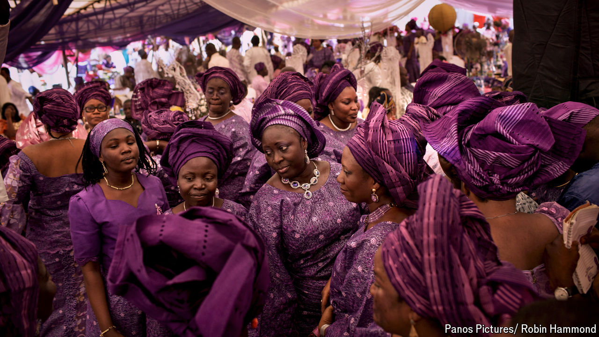

###### Nigeria parties on the cheap

# A Nigerian’s guide to weddings during the cozzie livs 

##### Even the most lavish of partygoers are adjusting to a cost-of-living crisis 

 

> Aug 29th 2024 

Yoruba weddings last months, not days. There is a party when families are introduced. A bigger one follows for traditional marriage rites and the presentation, from the groom’s family to the bride’s, of everything from yams to jewellery. Last comes the religious ceremony and a reception. The betrothed can cycle through over ten bespoke outfits during the celebrations. But as a cost-of-living crisis bites, people across Nigeria are learning how to party on the cheap.

