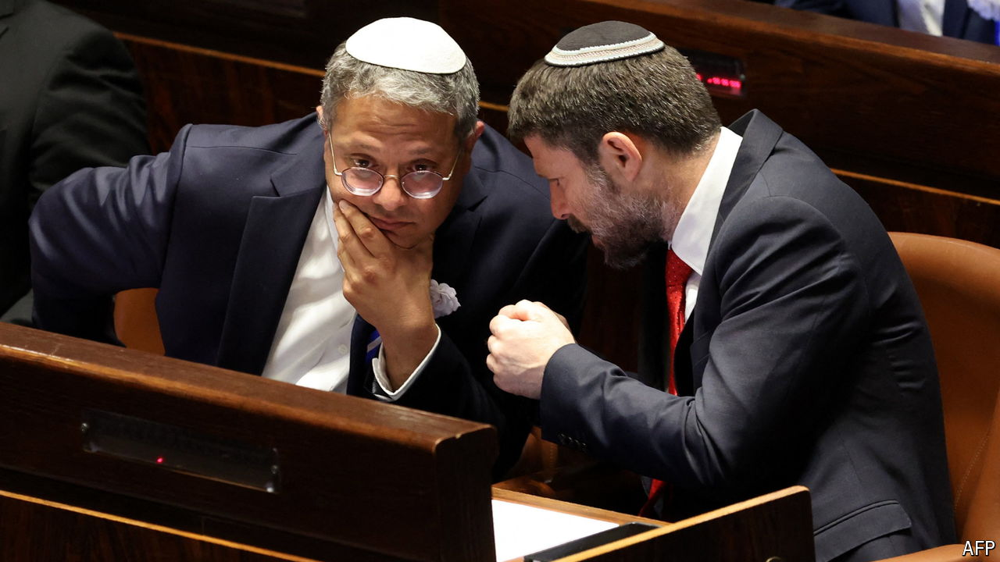

###### A kingdom divided

# Have Israel’s far-right religious nationalists peaked? 

##### They wield great power but schisms within the movement are deepening 

 

> Aug 29th 2024 

In opposition, religious nationalists were lured by the promise by Binyamin Netanyahu that he would lead a government of , Hebrew for the “full right”. They now hold great power in Israel’s government. But discord over how to wield it is cracking the movement.

