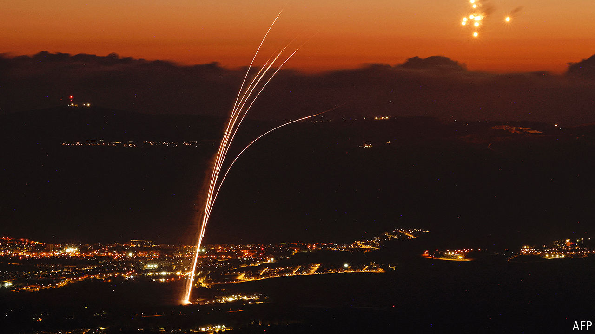

###### The Middle East

# Israel and Hizbullah play with fire 

##### They both attempt escalating attacks that fall short of all-out war 

 

> Aug 25th 2024 

IN A SERIES of air and missile strikes in the early hours of August 25th Israel and , the Iran-backed militia in , brought to a boil their simmering conflict. For now, at least, the strikes seem calibrated to avoid all-out war but it is a risky business. Just before 5am two waves of Israeli warplanes bombed dozens of Hizbullah’s missile-launch sites throughout . Minutes later Hizbullah launched at least 200 rockets and drones towards northern Israel. Israel’s Iron Dome missile-defence system intercepted most of these. The few that got through caused little damage and no Israeli casualties.

