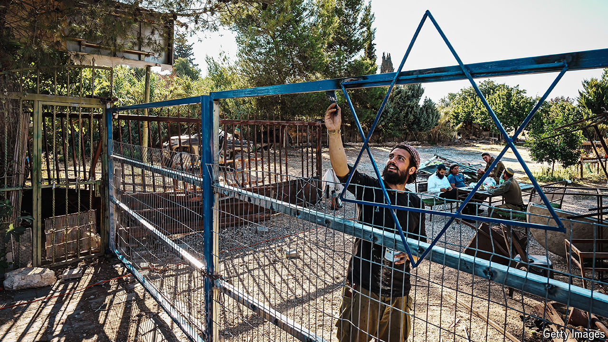

###### Real estate and religion

# Israel’s settlers are winning unprecedented power from the war in Gaza 

##### They are gaining land—and sway over the army, police and politics 

 

> Aug 27th 2024 

DRIVE ALONG Highway 60, which traverses the West Bank from north to south, and it feels like a real-estate road trip. It is festooned with signs in Hebrew offering “Two Last Apartments in Mitzpe Levona” and promising that “Your Grass Can be Greener” seen from a villa in Tzofim. These are boom times for Israel’s settlers, who are gaining land, military influence and political power. 

