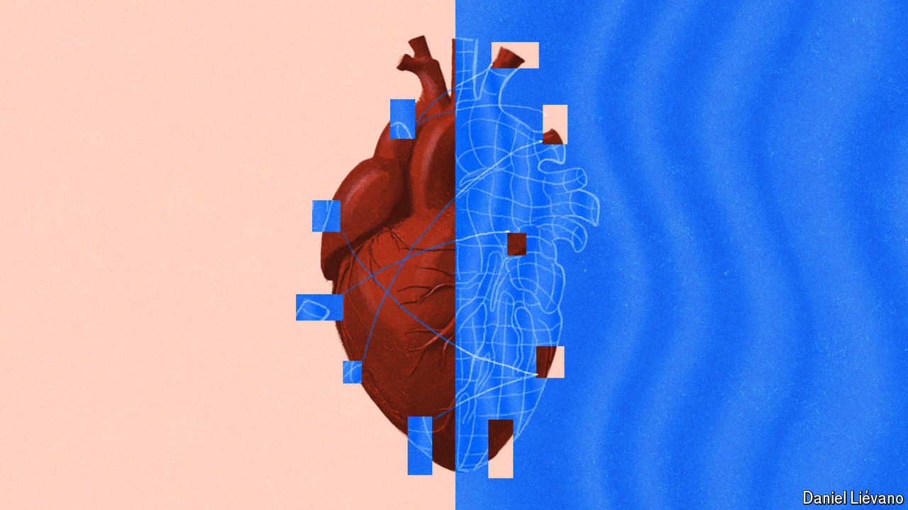

###### Mirror worlds

# Digital twins are enabling scientific innovation 

##### They are being used to simulate everything from bodily organs to planet Earth 

 

> Aug 28th 2024 

SCIENTISTS ARE no strangers to computer models. Some of the very first uses of computers to simulate reality, in fact, were built by physicists keen to understand the behaviour of subatomic particles, and meteorologists hoping to predict the weather. Over the 75 or so intervening years, computer modelling has become an integral part of scientific practice, informing everything from predictions of climate change to the monitoring of pandemics.

