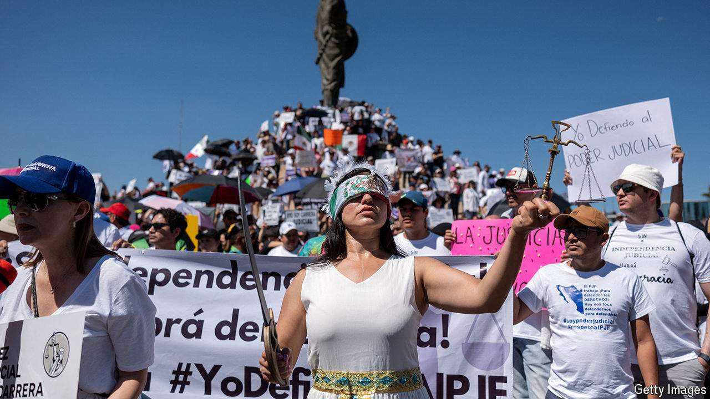

###### The rule of law in Mexico

# AMLO’s dangerous last blast threatens Mexico 

##### The outgoing president will use his last month in power to change the constitution 

 

> Aug 29th 2024 

Most Mexican presidents would be a lame duck in their last month in power. But not Andrés Manuel López Obrador. After newly elected congressmen and women take their seats on September 1st, a month before president-elect Claudia Sheinbaum takes office, Mr López Obrador will take advantage. His ruling party Morena and its allies will be so dominant he will almost certainly be able to pass a constitutional reform of the judiciary. 

