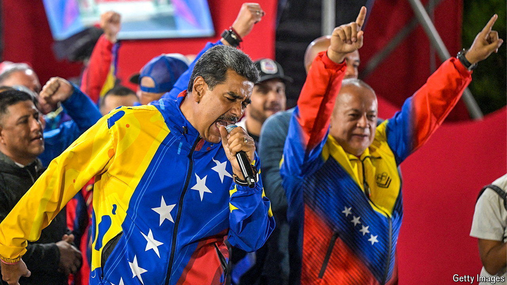

###### Still stolen

# Nicolás Maduro digs in with the help of a pliant Supreme Court 

##### His inner circle is another barrier to compromise 

 

> Aug 29th 2024 

One month after President Nicolás Maduro brazenly stole an election, the consequences still reverberate across Venezuela and the region. Border posts with Brazil teem with people desperate to leave. Inside the country thousands who protested have been targeted by a regime that is now openly hunting down its critics, even as all the major democracies in the region have either rejected the result or called for an impartial audit.

