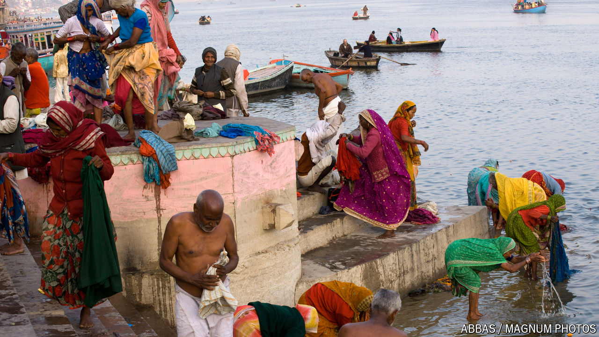

###### The Economist reads

# Six novels about India, perhaps the world’s most interesting place 

##### Works of fiction about a country whose global clout, already large, is growing 

 

> Aug 20th 2024 

THERE IS A case to be made that, to a Westerner, India is the most interesting place on Earth. This writer had that thought decades ago on the banks of the Ganges river in Varanasi, a city that is holy to Hindus. The river is at once a goddess, a laundry and a thoroughfare. People defecate on its banks, and when human bodies are cremated there sometimes mourners cannot afford to buy enough wood to finish the job. So many seemingly incompatible realities fused together! For such reasons, India has long fascinated outsiders. Increasingly it commands attention for other reasons. In 2023 India surpassed China to become the , with 1.4bn people. It is one of the world’s . In global affairs it is . Most of the novels we recommend below predate India’s recent rise to geopolitical prominence and are not celebratory. They have much to say about India’s troubles: tension between the Hindu majority and the Muslim minority, poverty, caste divisions and bureaucracy. They will entrance readers and educate them about one of the world’s most important and interesting places. 

